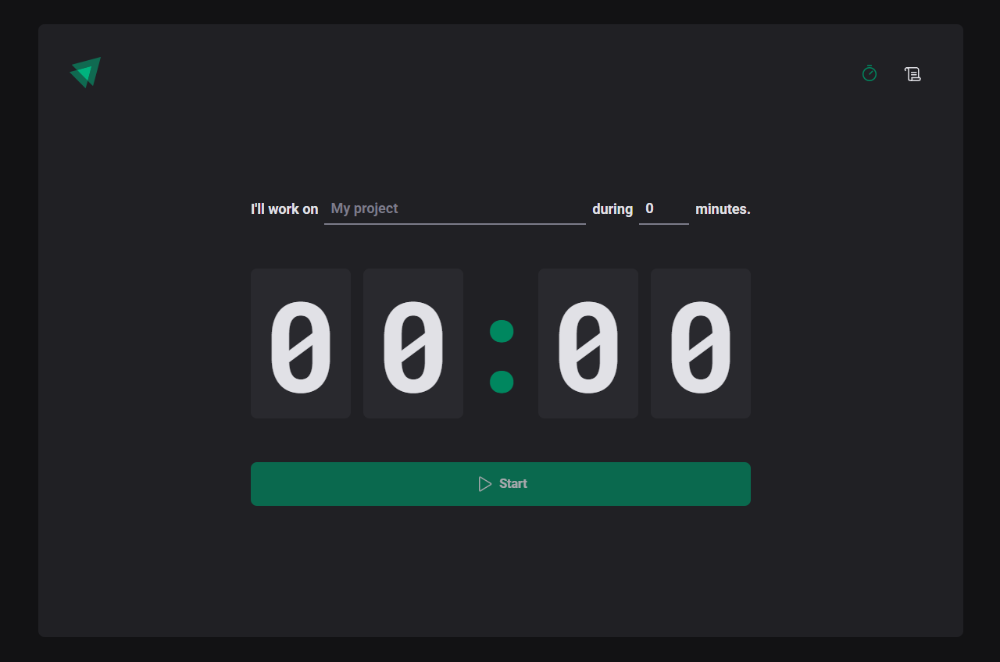

# Ignite Timer

A simple and practical front-end project to help you manage your time effectively!

## Description

Ignite Timer is an interactive timer that allows you to set a specific time to dedicate to a task. With just a few clicks, you can start the timer and focus on your work. When the time is up, the timer automatically resets, allowing you to start another cycle.

## Features

* Set project name
* Set dedication time (in minutes)
* Start and pause timer
* Automatic timer reset when time is up
* History of counters in a separate table

## Technologies Used

* React
* TypeScript
* Styled Components

## Getting Started

1. Clone the repository to your local machine
2. Run `npm install` to install dependencies
3. Run `npm start` to start the development server
4. Open `http://localhost:3000` in your preferred browser

## Usage

1. Enter project name and dedication time in the respective fields
2. Click the "Play" button to start the timer
3. Watch the time remaining and, when it's up, the timer will automatically reset
4. View the history of counters in the "History" table

### Future Plans

* Fix negative counter when stay in other page
* Improve UI/UX
* Fix tab title timer when change page